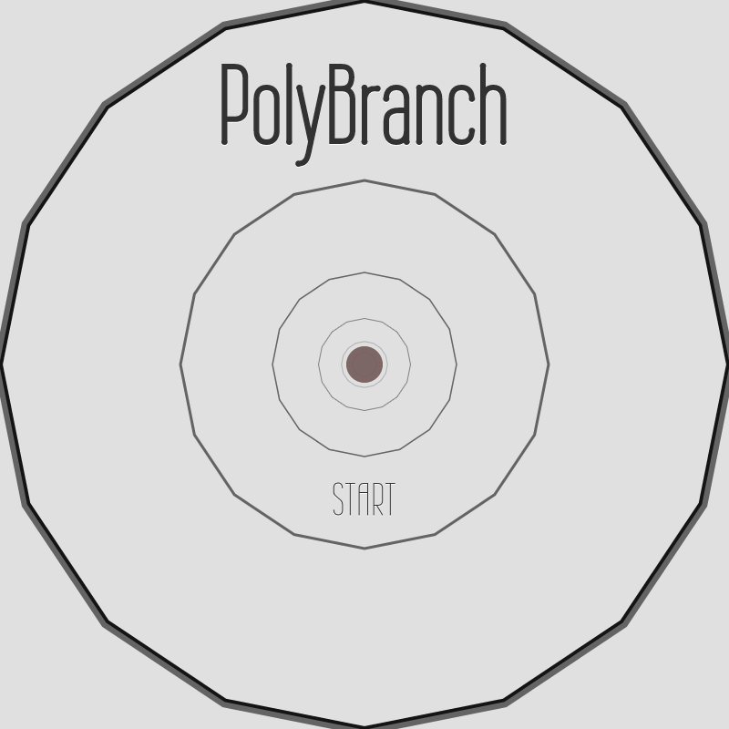
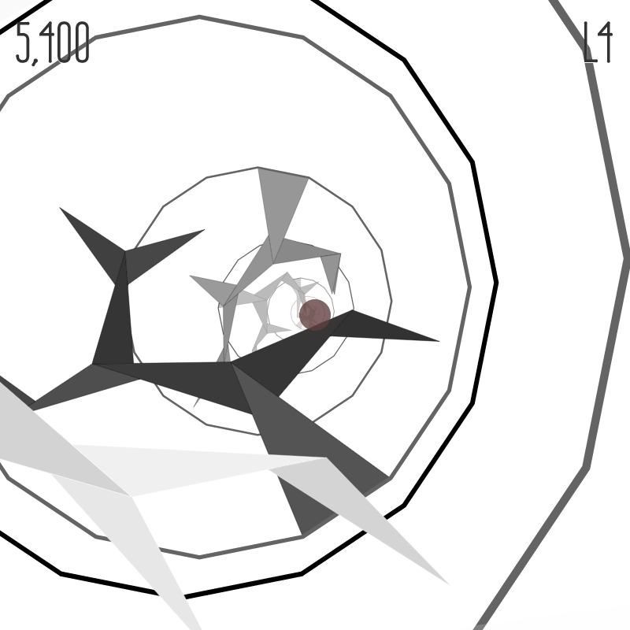

PolyBranch is a minimalist 3D game. Dodging branches may seem easy at first, but how long can you hold up as you approach terminal velocity?

http://gregbatha.com/branches/

## PolyBranch

[PolyBranch](http://gregbatha.com/branches/) is a minimalist 3D game. Avoid the branches protruding from the walls as you fly through the tunnel. Dodging branches may seem easy at first, but how long can you hold up as you approach terminal velocity? Dive in, stay focused, and enjoy the ride!

This game has been tested in all modern browsers, but runs best in Chrome. Please play in the latest version of Chrome when judging! :)

###Open Source!

Game core built with [Processing.js](http://processingjs.org/)

GUI built with HTML5 and [jQuery](http://jquery.com)

Font is [Wire One](http://www.google.com/webfonts/specimen/Wire+One) from [Google Web Fonts](http://www.google.com/webfonts)

The game graphics are designed by myself and drawn in realtime using Processing.js. The sounds are also created by myself using Logic Pro.
