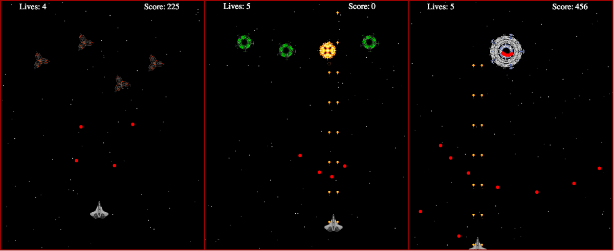

# Space Shooter

Play [Space Shooter](http://sangamk.com/spaceshooter)

## About

<p>Space Shooter is an arcade style shooting game. I developed this game to practice coding in JavaScript.</p>

<p>It features 3 enemy types and a Boss. Enemies attack in different formations. Their shooting rate increases with waves.

<p>The Boss has 3 different types of shooting patterns. It shoots in ring formations once it's remaining health is less than quarter.</p>

## Highlights
Modularized code base with object oriented design and prototypical inheritance.
```JavaScript
Util.inherits = function (ChildClass, ParentClass) {
  function Surrogate () { this.constructor = ChildClass };
  Surrogate.prototype = ParentClass.prototype;
  ChildClass.prototype = new Surrogate();
  ChildClass.prototype.constructor = ChildClass;
};

var Ship = SpaceShooter.Ship = function(specs){
  this.radius = Ship.RADIUS;
  this.pos = Ship.POS;
  this.vel = Ship.VEL;
  this.angle = Ship.ANGLE;
  this.speed = Ship.SPEED;
  this.firePower = 1;
  this.isVulnerable = true;
  SpaceShooter.MovingObject.call(this, specs);
};

SpaceShooter.Util.inherits(Ship, SpaceShooter.MovingObject);
```

Enhanced visual appeal by rendering 32 FPS and garbage collecting out-of-play objects.
```JavaScript
Game.prototype.removeOutOfBoundObjects = function () {
  this.playerBullets.forEach(function(bullet, idx){
      if(bullet.pos[0] < 0
        || bullet.pos[0] > Game.DIM_X
        || bullet.pos[1] < 0
        || bullet.pos[1] > Game.DIM_Y){
          //If Player-Bullet is out of bounds, delete it from game.
          this.playerBullets.splice(idx, 1);
        }
  }.bind(this));

  this.enemyBullets.forEach(function(bullet, idx){
      if(bullet.pos[0] < 0
        || bullet.pos[0] > Game.DIM_X
        || bullet.pos[1] < 0
        || bullet.pos[1] > Game.DIM_Y){
          //If Enemy-Bullet is out of bounds, delete it from game.
          this.enemyBullets.splice(idx, 1);
        }
  }.bind(this));
};

Game.prototype.enemyKilled = function () {
  this.enemyShips.forEach(function(ship, idx){
    if (ship.health <= 0) {
      this.drawLargeExplosion(ship.pos, ship.radius); //Draw Explosion
      this.enemyShips.splice(idx,1); //Delete Enemy
      this.score += this.wave.waveCount * 2; //Increment Score
    }
  }.bind(this));
};
```

Generated dynamic gameplay in HTML5 canvas by utilizing vector math for state updates.
```JavaScript
Util.normalizeVector = function (vector, offSet) {
  var x = vector[0];
  var y = vector[1];
  var len = Math.sqrt(Math.pow(x,2) + Math.pow(y,2));
  offSet = offSet || 0;

  x /= len;
  y /= len;

  return [x + offSet, y + offSet*0.7];
};

Util.vectorToPoint = function (origin, point, offSet) {
  var xDiff = origin[0] - point[0];
  var yDiff = origin[1] - point[1];
  offSet = offSet || 0;

  return Util.normalizeVector([xDiff, yDiff], offSet);
};

Util.bulletVel = function(shipPos, enemyPos, offSet){
  offSet = Math.random()*offSet*2 - offSet;
  offSet = offSet/100;
  return this.vectorToPoint(shipPos, enemyPos, offSet);
};
```

## Technologies Used
<p>Space Shooter is written in vanilla JavaScript.</p>
<p>It uses HTML5 canvas to render dynamic gameplay at 32 frames per second.</p>
<p>It uses <a href="https://github.com/madrobby/keymaster">keymaster</a> library for handling keyboard input.</p>
