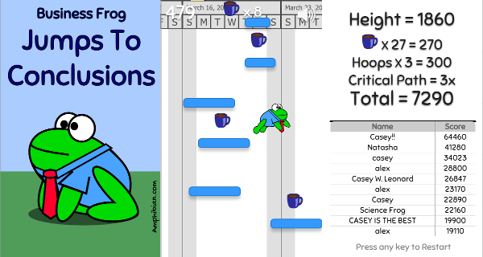

Business Frog Jumps to Conclusions
============

Join Business Frog from [Amphibian.com](http://amphibian.com) as he jumps through
the dystopian world of software project management. 

Play the latest version here: http://caseyleonard.com/ggo15/

## About the Game

This web-based game is a fork of [Octocat Jump](https://github.com/ogoshen/game-off-2012)
from the GitHub Game Off 2012, modified for the **GitHub Game Off 2015**.

The game is written in JavaScript using the [Crafty](http://craftyjs.com) framework.

It also uses some [jQuery](http://jquery.com/).

Modifications from the original game:

  * Changed the game from Octocat jumping on generic platforms to Business Frog jumping through a giant Gantt chart
  * Added a cake power-up that extends platforms
  * Added hoops to jump through for bonus points
  * Added apples that try to knock you down
  * Added the critical path bonus multiplier
  * Upgraded to the latest versions of Crafty and jQuery
  * Fixed some bugs
  * Added ability to restart the game after you fall
  * Added a high score system
  * Changed some of the sound effects

## How To Play

Business Frog is trying to manage a large and complicated software project. Use the
left and right arrow keys to guide his jumps through the Gantt chart.

Blue tasks are normal platforms that he can bounce on. The black platforms are major tasks - jumping on one is
a major boost forward! Hit the red critical path tasks in sequence to get a multiplier bonus
at the end of the game...but if you miss one the count starts all over!

Hit the briefcases to warp ahead.

As you get higher, apples (representing new requirements) will fly in from the sides and 
try to knock you off schedule.

Cake in the lunch room?
All your engineers just left their desks and the time-to-complete gets longer (temporarily).
Is that a good thing in this case?

Jump through management hoops for more bonus points.

## Credits

The original game was made by [Omar Goshen](https://github.com/ogoshen).

The CSS Loading Spinner is from [SpinKit](https://github.com/tobiasahlin/SpinKit).

### Graphics

The mute/speaker icons, portal, and smoke jump graphics are unmodified from the original game.
[Pow Studios](http://powstudios.com/content/smoke-animation-pack-1) is credited for the smoke jump sprite.

The Coffee Cup image is derived from "Coffee Cup" by
[barrettward](https://openclipart.org/user-detail/barrettward) and can be found
at https://openclipart.org/detail/193527/coffee-cup

I created the apple and cake images myself and submitted them to the public domain. You can download
them and other free graphics in SVG format from [OpenClipart](https://openclipart.org/user-detail/cwleonard).

The Business Frog images are from my webcomic [Amphibian.com](http://amphibian.com). Please don't
use them without my permission.

### Sound Effects

The following game sound effects are also licensed under [Creative Commons: By Attribution 3.0](http://creativecommons.org/licenses/by/3.0/).

  * Coffee Sound: (http://www.freesound.org/people/Cabeeno%20Rossley/sounds/126412/)

  * Apple Bonk Sound: (http://www.freesound.org/people/timgormly/sounds/170141/)

These game sound effects have been dedicated to the [public domain](http://creativecommons.org/publicdomain/zero/1.0/) by their authors.

  * Cake Sound: (http://www.freesound.org/people/plasterbrain/sounds/243020/)

  * Spinning Sound: (http://freesound.org/people/jhka/sounds/139001/)

  * Hoop Sound: (http://freesound.org/people/suntemple/sounds/253177/)

## About Me

This game fork was created by me, Casey Leonard. I make software for a living and I write a [web comic](http://amphibian.com) about
frogs who run a technology company. For more information, see [my web site](http://caseyleonard.com).

